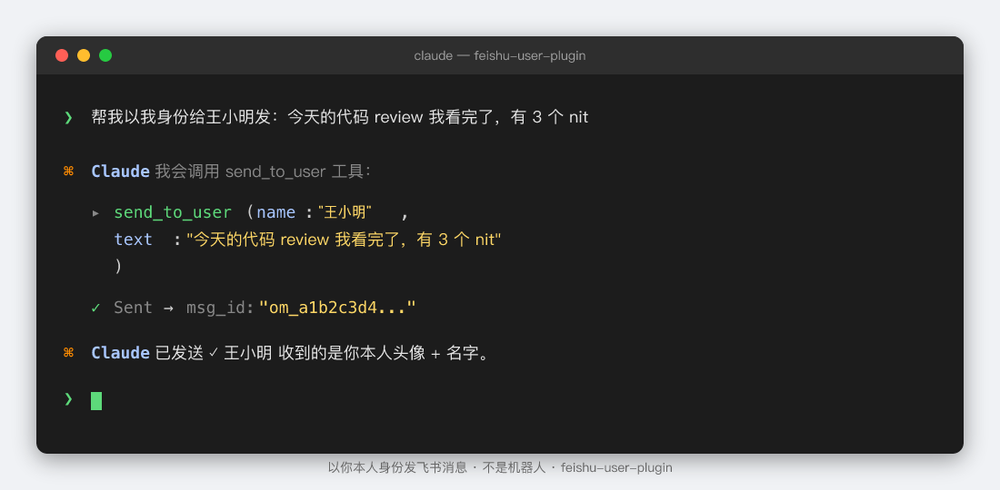

# feishu-user-plugin

[](LICENSE)
[](https://nodejs.org)
[](https://modelcontextprotocol.io)
[](#工具索引84-个)
[](https://www.npmjs.com/package/feishu-user-plugin)
[](CONTRIBUTING.md)

**中文** · [English](README.en.md) · [官网 / Docs](https://ethanqc.github.io/feishu-user-plugin/) · [CHANGELOG](CHANGELOG.md) · [npm](https://www.npmjs.com/package/feishu-user-plugin)

> All-in-one **飞书 MCP 服务器** —— 让 Claude Code、Codex、Cursor、Windsurf 等 MCP 客户端**以你本人身份**操作飞书，不是机器人。
>
> **84 tools · 3 auth layers · 9 MCP prompts · MIT licensed · Node ≥18**



---

## ⚠️ 使用边界与合规声明

**本项目仅用于个人与企业内部用途，不是商业 SaaS 产品。**

- **Cookie + protobuf 反向工程层**未经飞书官方背书。请遵守飞书《开发者服务协议》和你所在企业的 IT 政策。
- **官方 API 层**完全使用飞书公开开放 API，需要在飞书开放平台创建企业自建应用并申请相应权限。
- **不要**把 `LARK_COOKIE` / `LARK_USER_REFRESH_TOKEN` / 任何凭证文件提交到任何公开仓库。`~/.feishu-user-plugin/credentials.json` 默认 0600 权限。
- 公开商业部署 / 多租户 SaaS 场景请自行评估法律合规风险。
- 飞书更新 web 客户端时，cookie 反向工程层可能失效；机器人能力（Official API 层）不受影响。

---

## 这玩意解决什么问题

飞书官方开放 API **没有 `send_as_user` 权限点**：哪怕拿到 `user_access_token`，发出来的消息一律标记 `sender_type: "app"`，群里看到的是机器人头像 + "由 [应用名] 发送"。

很多场景里这不是 UX 问题，是阻断器：

- 机器人发的"周报"同事直接划走，没有"@真人"的存在感
- 自动化代你发的私聊一眼能看出来不是你写的
- 做飞书 RAG 时，用户身份和机器人身份混在一起也是合规雷区
- 想让 Claude Code 当你的飞书副驾驶，结果它发的所有消息都"露馅"

`feishu-user-plugin` 把三层鉴权融在一个 MCP server 里，让 Claude Code / Codex 既能**用机器人能力做苦活**（读群、爬文档、批量更新表格），又能**用你本人身份做沟通**（发消息、@同事、回复 review）。

## 三层鉴权一表看懂

| 鉴权层 | 凭证 | 干什么 | 工具数 |
|---|---|---|---|
| **用户身份** | `LARK_COOKIE`（cookie + protobuf 反向工程） | 以你本人身份发文本 / 图片 / 文件 / 富文本 / @ / 批量 | 8 |
| **官方 API** | `LARK_APP_ID` + `LARK_APP_SECRET` | 群消息读写 · 文档 · 多维表格 · 知识库 · 云空间 · 日历 · 任务 v2 · OKR · 联系人 · 实时事件 WS | 70+ |
| **用户 OAuth UAT** | `LARK_USER_ACCESS_TOKEN` + `LARK_USER_REFRESH_TOKEN` | P2P 私聊历史读取 · 用户 chat 列表 · 创建文档/Bitable/日历 资源时以你为 owner | 2 显式 + 全工具 UAT-first |

三层全配齐 = 完整能力。只配一层 = 该层工具可用，其他不可用。

## 核心能力速览

**消息（用户身份，cookie 协议）**
- `send_to_user` / `send_to_group` —— 发文本到任意 chat（自动解析 chat 名）
- `send_image_as_user` —— v1.3.9 起以你身份发图片（cookie protobuf 暴力探测得到的协议）
- `send_file_as_user` / `send_post_as_user` —— 发文件、富文本 Post（含 @ 提醒、超链）
- `batch_send` —— 一次发多条到不同 chat
- 全部自动解析 `oc_xxx` chat ID 到 numeric，缓存 10 分钟（v1.3.7+）

**消息（官方 API）**
- `read_messages` / `read_p2p_messages` —— 读群消息 / 读私聊；外部群自动 fallback 到 UAT；merge_forward 自动展开；text 自动提取 URL + 飞书文档链接
- `reply_message` / `forward_message` / `update_message` / `pin_message` / `add_reaction` 等机器人能力齐全
- `download_message_resource` —— 下载消息里的图片 / 文件

**文档生态**
- 文档：`search_docs` / `read_doc` / `read_doc_markdown`（v1.3.9 直接返回 markdown 节省 ~60% token）/ `manage_doc_block`（image / file 块快捷上传）
- 多维表格：`manage_bitable_app|table|field|view|record` + `upload_bitable_attachment`，500 条批量增删改
- 知识库：`list_wiki_spaces` / `search_wiki` / `create/update/move/copy/delete_wiki_node`
- 云空间：`list_files` / `create_folder` / `manage_drive_file` / `upload_drive_file`（支持直接上传到 Wiki 节点）

**协作工具**
- 日历：`list/create/update/delete/respond_calendar_event` + `get_freebusy`
- 任务 v2：`list/create/update/complete/delete_task` + `manage_task_members`
- OKR：`list_user_okrs` / `get_okrs` / `create/list/delete_okr_progress_record`

**实时事件（v1.3.9 机器级 SSOT）**
- 单进程持有 WS owner 锁，全机所有 MCP 进程共享 `events.jsonl`，每条事件**全机恰好一次**送达
- `get_new_events` 拉取增量；`manage_ws_status` 诊断 / 重连 / 抢锁 / 重配

**多账号**（v1.3.8 / v1.3.9 多 profile 自动切换）
- 单台机器配多套 cookie / app / UAT，工具调用自动按 chat / 资源归属选 profile
- 失败自动跨 profile retry（错误码 91403 / 1254301 / 1254000 / 99991672 / HTTP 403）
- 写入永远不自动切（避免错号创建资源）

## 5 分钟快速开始

### 1. 安装并配置

```bash
# 一行命令：安装 + 写入 ~/.claude.json mcpServers 配置
npx feishu-user-plugin setup --app-id <YOUR_APP_ID> --app-secret <YOUR_APP_SECRET>
```

> 没有 APP_ID / SECRET？看下面的 [创建飞书应用](#创建飞书应用) 5 步。

### 2. 拿用户 OAuth UAT（启用 P2P 读取）

```bash
npx feishu-user-plugin oauth
```

浏览器弹出授权页面，确认后 token 自动写入 `~/.feishu-user-plugin/credentials.json`。

### 3. 拿 cookie（启用以你身份发消息）

**推荐：自动化（Playwright MCP）** —— 跟 Claude Code / Codex 说一句"帮我设置一下飞书 cookie"，AI 会自动开浏览器扫码登录、提取 cookie 并写入配置。

**手动：DevTools** —— `feishu.cn/messenger` 登录 → F12 Network 标签 → 第一个请求 → Request Headers → Cookie 整行复制 → 写入 `LARK_COOKIE`。

> ⚠️ 不要用 `document.cookie` 或 Application > Cookies 标签 —— 拿不到 HttpOnly cookie（`session` / `sl_session`）。

### 4. 重启 Claude Code / Codex

### 5. 在 AI 里说人话

```
你：「帮我以我身份给王小明发：今天的代码 review 我看完了，有 3 个 nit」
Claude：[调用 send_to_user] ✓ 已发送
```

```
你：「总结下『工程组』群今天的讨论，发个日报到 #日报频道」
Claude：[调用 read_messages → 总结 → send_to_group] ✓
```

## 创建飞书应用

需要 `LARK_APP_ID` / `LARK_APP_SECRET` 才能用 Official API（占 70+ 工具）：

1. 打开 [飞书开放平台](https://open.feishu.cn/app) 登录
2. **创建自建应用**（不要选商店应用 / 第三方应用，否则 P2P 读取会被锁）
3. **添加应用能力 → 机器人**（启用 Bot capability）
4. **权限管理 → 添加以下 scope**：
    - `im:message`、`im:message:readonly`、`im:chat:readonly`（消息）
    - `docx:document`、`bitable:record`、`wiki:wiki:readonly`、`drive:drive:readonly`（文档）
    - `contact:user.base:readonly`（联系人）
    - 用 OKR / 日历 / 任务 v2 还要 `okr:okr:readonly` / `calendar:calendar:readonly` / `task:task` 等
5. **凭证与基础信息** → 复制 App ID（`cli_xxx`）+ App Secret → 配进 setup
6. **创建版本 → 提交审核 → 管理员审批** → 应用上线
7. 把 bot 加到要读消息的群里

## 工具索引（84 个）

完整工具列表 + 参数说明 + 跨域注意事项，详见 [CLAUDE.md](CLAUDE.md)。这里按域分类总览：

### 用户身份 —— 消息（cookie protobuf，8 个）

| 工具 | 说明 |
|---|---|
| `send_to_user` | 按名搜用户 + 发文本，一步完成 |
| `send_to_group` | 按名搜群 + 发文本，一步完成 |
| `send_as_user` | 按 chat ID 发文本，支持回复线程（`root_id` / `parent_id`） |
| `send_image_as_user` | 以你身份发图（v1.3.9，cookie protobuf 反向工程） |
| `send_file_as_user` | 以你身份发文件（需先 `upload_file` 拿 file_key） |
| `send_post_as_user` | 富文本：标题 + 段落 + @ 提醒 + 超链 |
| `send_card_as_user` | 飞书交互卡片（机器人通道，cookie 通道经 v1.3.9 暴力探测确认服务端关闭） |
| `batch_send` | 一次发多条到不同 chat（text / image / file / post） |

### 用户身份 —— 联系人 / 信息（cookie，5 个）

| 工具 | 说明 |
|---|---|
| `search_contacts` | 搜用户 / bot / 群 |
| `create_p2p_chat` | 创建或获取 P2P chat |
| `get_chat_info` | 群详情（接受 `oc_xxx` 或 numeric） |
| `get_user_info` | 用户名 / 头像查询 |
| `get_login_status` | 三层鉴权健康检查（实际跑一次 UAT 调用，不只是看配置） |

### 用户 OAuth UAT —— P2P 读取（2 个）

| 工具 | 说明 |
|---|---|
| `read_p2p_messages` | 读私聊历史（外部群自动 fallback） |
| `list_user_chats` | 列出用户加入的所有群（注意：仅群，不含 P2P；P2P 用 `search_contacts` → `create_p2p_chat`） |

### 官方 API —— IM（15 个）

| 工具 | 说明 |
|---|---|
| `list_chats` | 列 bot 加入的所有 chat |
| `read_messages` | 读群消息（接受 chat 名 / `oc_xxx` / numeric；外部群自动 UAT fallback；merge_forward 自动展开） |
| `send_message_as_bot` | 机器人发消息 |
| `reply_message` | 机器人回复 |
| `forward_message` | 转发到其他 chat（自动识别 receive_id_type） |
| `delete_message` | 撤回 / 删除 bot 消息 |
| `update_message` | 编辑已发消息（仅支持 text / interactive） |
| `add_reaction` / `delete_reaction` | 表情回应 |
| `pin_message` | 置顶消息 |
| `create_group` / `update_group` | 建群 / 改群 |
| `list_members` / `manage_members` | 群成员 list / add / remove（注意 `member_id_type` 与 ID 类型匹配） |
| `download_message_resource` | 下载消息附件（image / file，> 2 MiB 必须 `save_path`） |

### 官方 API —— 文档（7 个）

| 工具 | 说明 |
|---|---|
| `search_docs` | 关键词搜文档 |
| `read_doc` | 读结构化 JSON |
| `read_doc_markdown` | **v1.3.9** 直接返回 markdown，~60% token 节省（适合 RAG / 总结） |
| `get_doc_blocks` | 块树 |
| `create_doc` | 创建文档（可选 `wiki_space_id` 直接落地知识库） |
| `manage_doc_block` | 块 create / update / delete（image_path / file_path / image_token / file_token 快捷） |
| `download_doc_image` | 下载文档内嵌图片 |

### 官方 API —— 多维表格 Bitable（6 个，v1.3.7 整合）

| 工具 | actions | 说明 |
|---|---|---|
| `manage_bitable_app` | create / copy / get_meta | 应用级（创建可指定 `wiki_space_id` 直接落 Wiki） |
| `manage_bitable_table` | list / create / update / delete | 数据表 CRUD |
| `manage_bitable_field` | list / create / update / delete | 字段管理（update 必须传 `type` 即使只改名） |
| `manage_bitable_view` | list / create / delete | 视图（grid / kanban / gallery / form / gantt / calendar） |
| `manage_bitable_record` | search / get / create / update / delete | 记录 CRUD（create/update/delete 接受数组，单条或最多 500） |
| `upload_bitable_attachment` | — | 上传附件，返回 `file_token` 写入附件字段 |

### 官方 API —— 知识库 Wiki（9 个）

| 工具 | 说明 |
|---|---|
| `list_wiki_spaces` | 列空间（UAT-first，bot 路径返回 `scopeHint` 提示） |
| `search_wiki` | 搜知识库 |
| `list_wiki_nodes` | 列节点 |
| `get_wiki_node` | 节点 → obj_token 解析（接受 wiki node token 或 obj_token） |
| `create_wiki_node` | 创建节点（doc / sheet / bitable / mindnote / file / docx / slides） |
| `update_wiki_node` | 改名（内容编辑用 docx / bitable 工具） |
| `move_wiki_node` | 移动节点 |
| `copy_wiki_node` | 深拷贝节点 |
| `delete_wiki_node` | 删除 wiki 节点指针（底层 drive 资源用 `manage_drive_file(action=delete)` 删） |

### 官方 API —— 云空间 Drive（5 个）

| 工具 | 说明 |
|---|---|
| `list_files` | 列文件夹内文件 |
| `create_folder` | 建文件夹 |
| `manage_drive_file` | copy / move / delete（必须传 `type`） |
| `upload_image` / `upload_file` | 上传图片 / 文件，返回 key |
| `upload_drive_file` | 上传到 Drive 文件夹（可选 `wiki_space_id` 直接挂 Wiki 节点） |

### 官方 API —— OKR（6 个）

| 工具 | 说明 |
|---|---|
| `list_user_okrs` | 列指定用户的 OKR（必须传 user_id） |
| `get_okrs` | 批量取 OKR 详情（objectives + key results + progress + alignments） |
| `list_okr_periods` | 列周期（季度 / 年度） |
| `create_okr_progress_record` | 添加进展记录（v1.3.7，需 `okr:okr.content:write`） |
| `list_okr_progress_records` | 列进展记录（从 `get_okrs` 提取 triples） |
| `delete_okr_progress_record` | 删进展记录 |

### 官方 API —— 日历（8 个，写入 v1.3.7）

| 工具 | 说明 |
|---|---|
| `list_calendars` | 列日历（primary + 共享 + 订阅） |
| `list_calendar_events` | 列事件（指定时间窗） |
| `get_calendar_event` | 事件详情（参与人 / 地点 / 会议链接 / 附件） |
| `create_calendar_event` | 建事件（v1.3.7，需 `calendar:calendar.event:write`） |
| `update_calendar_event` | 改事件 |
| `delete_calendar_event` | 删事件（可选 `meeting_chat_id` 同时解散关联会议群） |
| `respond_calendar_event` | RSVP（accept / decline / tentative） |
| `get_freebusy` | 多人 freebusy 查询（找会议时段） |

### 官方 API —— 任务 v2（7 个，v1.3.7 新域）

标识符是 `task_guid`（不是 v1 的 numeric `task_id`），需 `task:task` scope。

| 工具 | 说明 |
|---|---|
| `list_tasks` | 列当前用户任务 |
| `get_task` | 任务详情 |
| `create_task` | 建任务（summary 必填） |
| `update_task` | 改任务（**必传 `update_fields=[...]`**，飞书只 patch 列出字段） |
| `complete_task` | 完成 / 取消完成 |
| `delete_task` | 删任务 |
| `manage_task_members` | add / remove 任务成员（assignee / follower） |

### 插件层 —— 诊断与多账号（4 个）

| 工具 | 说明 |
|---|---|
| `get_login_status` | 三层鉴权健康检查 |
| `list_profiles` | 列可用 profile（默认 + LARK_PROFILES_JSON / credentials.json） |
| `switch_profile` | 切 profile（缓存的 client 实例下次调用重建） |
| `manage_profile_hints` | 查 / 改 / 清 自动切换缓存（list / set / clear） |

### 插件层 —— 实时事件（2 个，v1.3.9）

| 工具 | 说明 |
|---|---|
| `get_new_events` | 拉取增量事件（peek=true 不推进 cursor；filter by event_type / chat_id / since_seconds / profile） |
| `manage_ws_status` | info / reconnect / claim / rotate / reconfig（诊断 / 重连 / 抢锁 / 强制 events.jsonl 轮转 / 不重启重新订阅） |

## 9 个 MCP prompts（slash commands）

Claude Code、Codex、Cursor、OpenClaw、Windsurf 都能识别：

| Prompt | 干什么 |
|---|---|
| `/send` | 以你身份发消息 |
| `/reply` | 读最近消息然后回 |
| `/digest` | 群 / P2P 最近消息总结 |
| `/search` | 搜联系人 / 群 |
| `/doc` | 搜 / 读 / 建飞书文档 |
| `/table` | 操作多维表格 |
| `/wiki` | 搜知识库 |
| `/drive` | 列云空间文件 / 建文件夹 |
| `/status` | 检查三层鉴权状态 |

## 各客户端配置

所有客户端的环境变量配置一致，只是配置文件路径和键名略不同。

**统一的 env 块**：
```json
{
  "command": "npx",
  "args": ["-y", "feishu-user-plugin"],
  "env": {
    "LARK_COOKIE": "your-cookie-string",
    "LARK_APP_ID": "cli_xxxxxxxxxxxx",
    "LARK_APP_SECRET": "your-app-secret",
    "LARK_USER_ACCESS_TOKEN": "your-uat",
    "LARK_USER_REFRESH_TOKEN": "your-refresh-token"
  }
}
```

**各客户端的安放位置**：

| 客户端 | 配置文件 | 顶层键 |
|---|---|---|
| Claude Code | `~/.claude.json`（推荐全局） / `.mcp.json` | `mcpServers.feishu-user-plugin` |
| Claude Desktop | `~/Library/Application Support/Claude/claude_desktop_config.json` (macOS) | `mcpServers.feishu` |
| Codex | `~/.codex/config.toml` | `[mcp_servers.feishu-user-plugin]`（TOML 格式） |
| Cursor | `.cursor/mcp.json`（项目级） | `mcpServers.feishu` |
| VS Code (Copilot) | `.vscode/mcp.json` | `servers.feishu`（注意是 `servers`，不是 `mcpServers`） |
| OpenClaw | `~/.openclaw/openclaw.json` | `mcp.servers.feishu-user-plugin` |
| Windsurf | `~/.codeium/windsurf/mcp_config.json` | `mcpServers.feishu` |

**自动化设置**：

```bash
npx feishu-user-plugin setup                       # 默认写 Claude Code (~/.claude.json)
npx feishu-user-plugin setup --client codex        # Codex (~/.codex/config.toml)
npx feishu-user-plugin setup --client both         # Claude Code + Codex 都写
npx feishu-user-plugin setup --activate            # 激活当前 profile
```

**详细 JSON 模板（对照 vs 复制）**：见 [README.en.md `MCP Client Configuration` 段](README.en.md#mcp-client-configuration)。

## 多账号（v1.3.8 / v1.3.9）

`~/.feishu-user-plugin/credentials.json` 支持多 profile（默认 + 任意附加），单台机器一处配置覆盖多个飞书账号 / 多个企业。

```bash
# 列 profile
npx feishu-user-plugin list-profiles

# 切默认（写 active 字段）
npx feishu-user-plugin switch-profile <name>

# 跨 profile keepalive（cron 友好）
npx feishu-user-plugin keepalive --all
```

**自动切换**：读路径工具（`read_*` / `list_*` / `get_*` / `search_*` / `download_*`）失败码 91403 / 1254301 / 1254000 / 99991672 / HTTP 403 时自动跨 profile retry。写路径**永远不切**（避免错号创建资源）。

**单调用覆盖**：传 `via_profile: "<name>"` 钉到指定 profile，传 `via_profile: "auto"` 给写路径开自动切换的逃生口。

详见 [CLAUDE.md "Multi-profile auto-switch" 段](CLAUDE.md#multi-profile-auto-switch-v138)。

## 实时事件（v1.3.9 机器级 SSOT）

机器上**单进程持有 WS owner 锁**（`~/.feishu-user-plugin/ws-owner.lock`，O_CREAT|O_EXCL，30s stale），所有 MCP 进程共享 `~/.feishu-user-plugin/events.jsonl`（10 MB 软 / 20 MB 硬限自动轮转），`events.cursor.json` 是全机所有 harness 共享的 drain cursor —— **每条事件全机恰好一次**。

```bash
# 看谁在持锁、当前订阅、events.jsonl 大小
mcp call manage_ws_status --action info

# 抢锁（force=true 跨进程接管）
mcp call manage_ws_status --action claim --force true
```

默认订阅 `["im.message.receive_v1"]`。要订阅其他事件（审批 / 日历 / 飞书 V3 vc / etc），编辑 `credentials.json::profiles[<active>].events`，然后 `manage_ws_status(action=reconfig)` 不重启重新订阅。

仅支持 feishu.cn —— Lark 国际版（lark.com）的 WSClient 当前不支持。

## 工程细节

### Token 生命周期

| 鉴权层 | Token | 有效期 | 自动续期 |
|---|---|---|---|
| Cookie | `sl_session` | 12h max-age | 4 小时心跳自动刷新 |
| App | `tenant_access_token` | 2h | SDK 自动管理 |
| User OAuth | `user_access_token` | ~2h | 通过 refresh_token 自动刷新，写回 credentials.json |
| Refresh Token | — | 7 天 | 用 `keepalive` cron 防过期 |

```bash
# 把 keepalive 加进 cron（每 4 小时跑一次）
crontab -e
# 0 */4 * * * npx feishu-user-plugin keepalive >> /tmp/feishu-keepalive.log 2>&1
```

UAT 刷新失败 `invalid_grant` —— refresh token 已过期 / 撤销，跑 `npx feishu-user-plugin oauth` 重新授权再重启 Claude Code / Codex。

### 凭证存储（v1.3.7+）

单一可信源 `~/.feishu-user-plugin/credentials.json`（mode 0600），多 harness 共享。schema 见 [docs/CREDENTIALS-FORMAT.md](docs/CREDENTIALS-FORMAT.md)。

opt-in 迁移：
```bash
npx feishu-user-plugin migrate              # 干跑
npx feishu-user-plugin migrate --confirm    # 真写
```

### 自动 sync hooks

| 阶段 | 文件 | 作用 |
|---|---|---|
| pre-commit | CLAUDE.md staged | 自动同步到 AGENTS.md + skill 引用 |
| pre-commit | package.json / plugin.json / SKILL.md staged | 三角等价检查（version 必须一致） |
| pre-commit | src/server.js / src/tools/* staged | tools 个数 + README 84 tools 徽章必须一致 |
| pre-commit | src/* staged | smoke test |
| post-merge (main) | 任意 | 自动开 team-skills sync PR |

CI（`.github/workflows/validate.yml`）每个 PR 都跑同样的 gate。

## 限制 / Known Limitations

- **Cookie 寿命**：12-24 小时无心跳会过期，需要重新登录 feishu.cn 拿 cookie
- **协议变化风险**：cookie + protobuf 层依赖飞书 web 客户端的内部协议，飞书更新有概率失效
- **图片 / 文件 / 音频发送**：用户身份的图片发送（v1.3.9）已突破，cookie 通道发卡片**服务端关闭**（v1.3.9 暴力探测确认）
- **Lark 国际版**：实时事件 WS 不支持（Feishu WSClient 限制）
- **未实现**：`search_messages`（v1.3.10 计划）、md → wiki 同步（v1.3.10 主线）

完整 ROADMAP 见 [ROADMAP.md](ROADMAP.md)。

## 贡献

Issues 和 PR 都欢迎。提交前先看 [CONTRIBUTING.md](CONTRIBUTING.md) —— dev setup、smoke gate、PR checklist、新增工具的标准流程。

飞书改协议导致功能挂掉 —— [开 issue](https://github.com/EthanQC/feishu-user-plugin/issues/new) 带上错误日志即可。

## License

[MIT](LICENSE)

## 致谢

- [cv-cat/LarkAgentX](https://github.com/cv-cat/LarkAgentX) —— 早期飞书协议反向工程（Python）
- [cv-cat/OpenFeiShuApis](https://github.com/cv-cat/OpenFeiShuApis) —— 底层 API 研究
- [Model Context Protocol](https://modelcontextprotocol.io) —— MCP 标准 + Anthropic / PulseMCP / GitHub / Stacklok 共维 registry
- [Anthropic Claude Code](https://claude.com/claude-code) —— 本仓库 80% 的开发由 Claude Code 完成

---

<small>Maintained by [@EthanQC](https://github.com/EthanQC) with Claude Code.</small>
